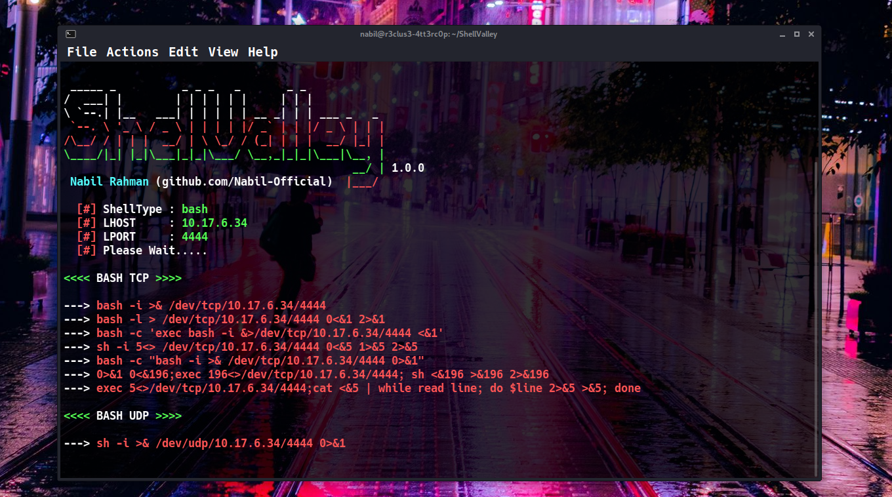
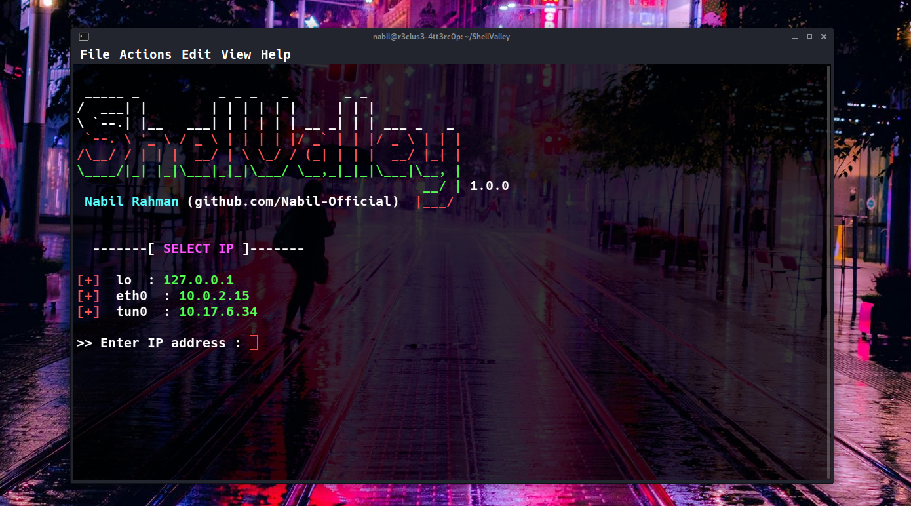
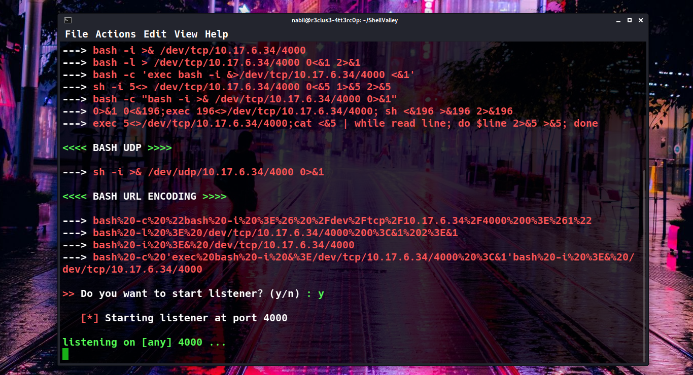

<h1 align="center">
 <a href="#"></a>
 <br>
  ShellValley
 <br>
</h1> 
<h4 align="center"><i>ShellValley</i> is a user-friendly reverse shell generator tool, specially designed for CTF players who prefer to stay within their terminal while generating reverse shells swiftly.</h4> 

<p align="center">
 <a href="https://github.com/Nabil-Official">
  
 </a>
 
</p>

<br>


### ► Installation

```bash
git clone https://www.github.com/Nabil-Official/ShellValley
cd ShellValley
python3 run.py -h
```
### ► usage
```bash
python3 run.py -s bash -p 4000 -i 127.0.0.1
```
### ► Supported reverse shells
__default__: `bash`

Reverse shells |
|-|
| bash |
| php |
| python |
| python3 |
| perl |
| java |
| javascript |
| node |
| netcat |
| awk |
| gawk |
| telnet |
| golang |
| powershell |
| tclsh |
| ruby |
| xterm |
| ncat |
| socket |

### ► Screenshots

Screenshot 1             |  Screenshot 2
:-----------------------:|:-----------------------:
  |  

### ► Disclaimer

***This tool is intended solely for testing and educational purposes, and its use is permissible only with explicit and proper consent. Under no circumstances should it be employed for illegal activities. Users must take full responsibility for adhering to all relevant local, state, and federal regulations. The developers disclaim any liability and cannot be held accountable for any inappropriate use or harm resulting from the utilization of this tool and software.***

### ► Contact:
[](mailto:rjnabilrahman@gmail.com) [)](https://www.facebook.com/nabil.404)

<br>

```bash
 _____ _          _ _ _   _       _ _                                                
/  ___| |        | | | | | |     | | |                                               
\ `--.| |__   ___| | | | | | __ _| | | ___ _   _                                     
 `--. \ '_ \ / _ \ | | | | |/ _` | | |/ _ \ | | |                                    
/\__/ / | | |  __/ | \ \_/ / (_| | | |  __/ |_| |                                    
\____/|_| |_|\___|_|_|\___/ \__,_|_|_|\___|\__, |                                    
                                            __/ | 1.0.0                              
 Nabil Rahman (github.com/Nabil-Official)  |___/                                     
                                                                                     
                                                                                     
usage: run.py [-h] [-l] [-i LHOST] [-p PORT] [-s SHELL]                              
                                                                                     
=================== Help Center ====================                                 
                                                                                     
optional arguments:                                                                  
  -h, --help            show this help message and exit                              
  -l, --list            list of available shells (More shells will be added in the   
                        future)                                                      
  -i LHOST, --ip LHOST  specify IP address                                           
  -p PORT, --port PORT  specify port                                                 
  -s SHELL, --shell SHELL                                                            
                        specify shell type  

```
